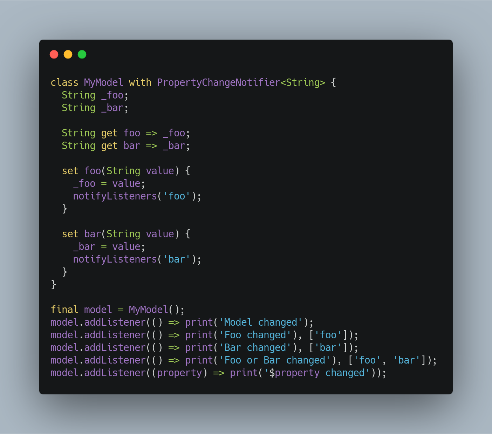

# property_change_notifier

A drop-in replacement for [ChangeNotifier](https://api.flutter.dev/flutter/foundation/ChangeNotifier-class.html) that lets listeners observe only certain properties of a model.



## Why?

[ChangeNotifier](https://api.flutter.dev/flutter/foundation/ChangeNotifier-class.html) is useful for observing changes to a model. The problem is that it takes an all-or-none approach. There is no way to listen only to specific properties. To do so requires every property to be implemented as a [ValueNotifier](https://api.flutter.dev/flutter/foundation/ValueNotifier-class.html) or similar. Even then, it is not possible to listen to multiple properties with a single listener.

`PropertyChangeNotifier` is an implementation of a more granular observer pattern similar to [PropertyChangeListener](https://docs.oracle.com/javase/7/docs/api/java/beans/PropertyChangeListener.html) in Java and [INotifyPropertyChanged](https://docs.microsoft.com/en-us/dotnet/api/system.componentmodel.inotifypropertychanged.propertychanged?view=netframework-4.8) in .NET. **When a property changes, the name of the property is included in the event. Listeners can then choose to observe only one or many properties.**

## How?

`PropertyChangeNotifier` works by extending [ChangeNotifier](https://api.flutter.dev/flutter/foundation/ChangeNotifier-class.html) in a way that makes it 100% backwards compatible with existing code.

1. Replace `ChangeNotifier` with `PropertyChangeNotifier` in your model.
1. Update your model to include the property name when calling `notifyListeners()`.
1. Existing listeners will continue to receive all property updates as before. Over time, update those listeners to only observe specific properties.

You may even want to consider *starting* with `PropertyChangeNotifier` in your models so that you can be as coarse or fine-grained as you want.

## Usage

### Model implementation

```
class Foo extends PropertyChangeNotifier {
  String _bar;
  String _baz;

  String get bar => _bar;
  String get baz => _baz;

  void set bar(String value) {
    _bar = value;
    notifyListeners('bar');
  }

  void set baz(String value) {
    _baz = value;
    notifyListeners('baz');
  }
}
```

### Listen to a single property only
Update existing listeners by passing in an additional parameter containing the property name you wish to observe, wrapped in a `List`:

```
final model = Foo();
model.addListener(_listener, ['bar']);

void _listener() {
  ...
}

```

### Listen to multiple properties
Create a listener with a callback and a `List` containing the property names you wish to observe:

```
final model = Foo();
model.addListener(_listener, ['bar', 'baz']);

void _listener() {
  ...
}

```

### Listen to all properties
This is the default behavior of `ChangeNotifier` and is not affected, even if you've update your model to invoke `notifyListeners()` with a property name.

```
final model = Foo();
model.addListener(_listener);

void _listener() {
  ...
}

```

### Adding listeners
Listeners can be added at any time. A listener cannot be `null`. Adding a listener with no parameters causes it to listen to all properties. The same listener can be added to multiple properties. The same listener *cannot* be added multiple times to the same property. It doesn't hurt to add a listener to a non-existent property, but it serves no purpose. `PropertyChangeNotifier` does not check if the property actually exists. 

```
final model = Foo();
model.addListener(_barListener, ['bar']);
model.addListener(_bothListener, ['bar']);
model.addListener(_bothListener, ['baz']);
model.addListener(_allListener);

// _barListener is listening to bar only.
// _bothListener is listening to bar and baz only.
// _allListener is listening to all properties.

```

### Removing listeners
Listeners can be removed at any time. A listener can be removed from one or more properties without being removed from other properties. Removing a listener on a property that does not exist is a no-op.

```
final model = Foo();
model.addListener(_listener, ['bar', 'baz', 'bah']);
model.removeListener(_listener, ['bar', 'bah']);

// _listener is now listening to baz only.

```

### Property names

Referring to properties by string is error-prone and results in [stringly-typed](https://www.techopedia.com/definition/31876/stringly-typed) code. To avoid this, you can create string constants:

```
class FooProperties {
  static String get bar => 'bar';
  static String get baz => 'baz';
}
```

Or you can even create an enum:

```
enum FooProperties {
  bar,
  baz,
}
```

Now you can reference these values in both your model and listeners so that they can be safely checked by your compiler:

```
// Model
class Foo extends PropertyChangeNotifier {
  ...
  void set bar(String value) {
    _bar = value;
    notifyListeners(FooProperties.bar);
  }
  ...
}

// Listener
final model = Foo();
model.addListener(_listener, [FooProperties.bar]);
```

You can even use your own custom types as property names. They just must extend [Object](https://api.dartlang.org/stable/2.4.0/dart-core/Object-class.html) and correctly implement equality using ``==`` and ``hashCode``.

## Unit Tests

This library has 100% [test coverage](coverage/index.html) and uses the underlying [ChangeNotifier](https://api.flutter.dev/flutter/foundation/ChangeNotifier-class.html) implementation as much as possible.